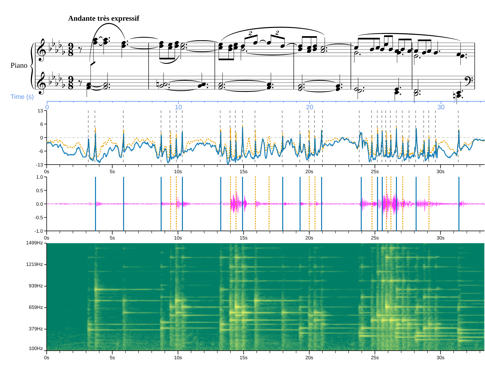

# LayerIt — ISMIR 2026 LBD Video Script
**Format:** PowerPoint slides + voice-over narration
**Target length:** ~3 minutes (~420 spoken words at a calm presentation pace)
**Speaker:** Fernando Azeredo

---

## SECTION 1 — Problem Statement
**Slides 1–2 | ~0:00–0:40**

---

### Slide 1
**Title slide**
- *LayerIt: Towards a Framework for Time-Aligned, Composable Music Visualisations*
- Fernando Azeredo · António Sá Pinto
- Faculdade de Engenharia da Universidade do Porto / INESC TEC
- ISMIR 2026 — Late-Breaking Demo

---

### Slide 2
**Slide title:** The Problem

**Visual:**
 
 

**Narration (~35 s):**
> Music Information Retrieval research regularly relies on figures that combine audio, algorithmic data, and symbolic representations on shared visualisations. But assembling these composites is still largely a manual or "ad hoc" processes that often are labour intensive and/or non reproducible.

---

## SECTION 2 — Developed Solution
**Slides 3–4 | ~0:40–1:15**

---

### Slide 3
**Slide title:** Introducing LayerIt

**Visual:** LayerIt logo / name centred. Below, three icons arranged left to right:
1.  Score 
2. Audio 
3. Algorithmic output (beat tracker, spectrogram, …)
→ Arrow pointing right to: **One SVG**


**Narration (~30 s):**
> LayerIt was created as a proposal for a framework to tackle this issue. It is an open-source Python framework that attempts to solve this programmatically by enabling alignment between heterogeneous visualizations of audio, algorithmic data, and music scores into a combined view with a user-defined arrangement. It relies on a time-warped score (obtained via ScoreWarp) to align the visualizations onto a shared performance-time axis, where they are merged into a single, structured SVG. Each component — waveform, spectrogram, beat logits, onset markers — is a self-contained layer. You add them, you compose them, and the temporal alignment is determined for you. 

---

### Slide 4
**Slide title:** Key Design Principles

**Visual:** Three-column layout (no prose, just labels):

| Shared time axis | Composable layers | Structured SVG output |
|---|---|---|
| One scale factor: pixels per second, read from the warped score | Each layer implements `load_data()` + `draw()` | MEI identifiers and layer groups preserved — not a flat raster |

**Narration (~15 s):**
> The design rests on three ideas: a single shared time axis derived from the warped score; a common layer interface so any representation can plug in; and an SVG output that keeps the score's MEI structure and each added component individually addressable.

---

## SECTION 3 — How LayerIt Works (Example)
**Slides 5–6 | ~1:15–2:10**

---

### Slide 5
**Slide title:** The Script — 5 Lines

**Visual:** Code block (use the lstlisting style from the LBD paper, large font):

```python
fig = Visualizer(audio, score, maps, beats)
fig.add_panel(Onset(), BeatLogits(), DownbeatLogits(), height=.5)
fig.add_panel(Waveform(), BeatsLayer(), DownbeatsLayer(), height=.5)
fig.add_panel(MelSpec(freq_window=(100, 1500)))
fig.compose("LBD_FIG.svg")
```

Below the code block, small annotation arrows pointing to each line:
- Line 1 → *"Inputs declared once"*
- Lines 2–4 → *"One call per panel; layers compose freely"*
- Line 5 → *"Single SVG out"*

**Narration (~25 s):**
> Here is the complete script that produces the demonstration figure. Five statements. The inputs — audio, warped score, onset alignment, and beat-tracker output — are declared once on line one. Each `add_panel` call stacks a new row of layers.

---

### Slide 6
**Slide title:** The Output — Clair de Lune

**Visual:** The full LayerIt composite figure (output.png from the LBD paper), enlarged to fill the slide. Label the four panels on the right margin:
1. Warped score
2. Beat / downbeat logits + onset markers
3. Waveform + beat / downbeat estimates
4. Mel spectrogram

**[Action]** Animate a vertical dashed line sweeping left to right across the slide (approximately 3 s) to illustrate the shared time axis.

**Narration (~30 s):**
> The demonstration uses the first six bars of Debussy's Clair de Lune, performed by Maria João Pires. Beat and downbeat activations from Beat This! are shown alongside waveform and spectrogram panels, all anchored to the time-warped score at the top. Reading across, you can see that most downbeats are placed correctly, but several false positives fall on quaver onsets. The notation reveals immediately why: compound triple metre in an expressively played Andante is a known difficulty for beat trackers trained on metrically regular repertoire. Without the score on the same axis, those errors are just a list. With it, they become a diagnosis.

---

## SECTION 4 — Conclusions
**Slide 7 | ~2:10–2:35**

---

### Slide 7
**Slide title:** What LayerIt Delivers

**Visual:** Three bullet points, each appearing on click:
- ✅ **Reproducible** — re-run the script, regenerate the figure
- ✅ **Composable** — swap a layer, change a tracker, add a panel
- ✅ **Structured output** — MEI identifiers and layer groups survive in the SVG

Below, a small note: *Open source · pip-installable · github.com/FernandoAze/LayerIt*

**Narration (~20 s):**
> LayerIt makes these composites reproducible — change the recording or the algorithm and re-run the script. It is composable — layers are independent and interchangeable. And its SVG output is structured: the score's semantic information and each added component remain individually addressable, rather than being flattened into a raster image.

---

## SECTION 5 — Future Work
**Slide 8 | ~2:35–3:00**

---

### Slide 8
**Slide title:** What Comes Next

**Visual:** Two columns:

**Interaction**
- Add an interaction layer for audio playback and annotation features
- Score-aligned SVG as annotation interface
- Every component is addressable → interactive, playback-synchronised viewer is a natural extension

**Alignment inputs**
- Read Sync Toolbox alignments → automatic synchronisation
- Adopt Time to Align! format → preserve provenance and domain information

**Narration (~20 s):**
> Two directions follow. First, interaction: adding an audio playback and annotation layer would turn the score-aligned SVG into a direct annotation interface, and because every component remains addressable, an interactive, playback-synchronised viewer is a natural extension of the present design. Second, broadening the alignment input: reading Sync Toolbox output would extend LayerIt to automatic synchronisation, and adopting the Time to Align format would preserve provenance and domain information.

---

### Slide 9
**Content:** Thank-you line and GitHub URL.

## Production Notes

- **Slide font:** Keep large (≥24 pt body); this is a 3-minute video, not a paper.
- **Code slide (Slide 5):** Use a monospace font with syntax highlighting matching the LBD paper style (dark background or light with keyword bolding).
- **Figure slide (Slide 6):** Use the actual `output.png` from the repo; make it as large as the slide allows.
- **Narration pace:** Target ~130 words/minute. Record dry first, then adjust timing to match the animation cues on Slides 5 and 6.
- **Captions:** Add auto-generated captions (PowerPoint Presenter Coach or a separate SRT file) for accessibility.

